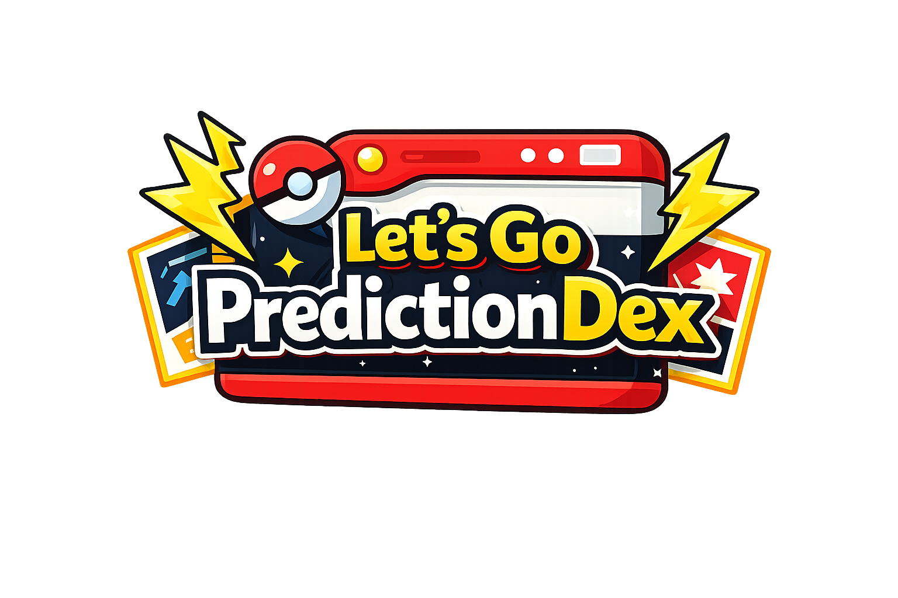

# PredictionDex

Prédicteur de combats pour Pokémon Let's Go Pikachu/Eevee. Le projet couvre tout le pipeline : collecte de données, entraînement d'un modèle XGBoost, API REST, interface web Streamlit, et monitoring.

Réalisé dans le cadre d'une certification RNCP (blocs E1 et E3).

## Démarrage rapide

```bash
git clone https://github.com/benjsant/lets-go-predictiondex.git
cd lets-go-predictiondex
cp .env.example .env
cp interface/.env.example interface/.env
# Configurer API_KEYS et STREAMLIT_API_KEY dans .env

docker compose up --build
```

Au premier lancement, l'ETL et l'entraînement ML tournent (~60-90 min). Les lancements suivants prennent 2-3 min.

Interfaces disponibles :
- API Swagger : http://localhost:8080/docs
- Streamlit : http://localhost:8502
- Grafana : http://localhost:3001 (admin/admin)
- Prometheus : http://localhost:9091
- MLflow : http://localhost:5001
- pgAdmin : http://localhost:5050

## Le projet en bref

PredictionDex prédit l'issue de combats Pokémon en se basant sur les stats, types et capacités. Le modèle XGBoost est entraîné sur ~900k combats simulés à partir des 188 Pokémon du jeu (Gen 1 + Alola + Mega), 226 capacités et la matrice des 18 types.

Le modèle v2 atteint **95.70% d'accuracy** sur le jeu de test (ROC-AUC : 99.4%).

## Architecture

```
Sources (CSV + PokeAPI + Scraping Pokepedia)
        |
  ETL Pipeline (5 phases)
        |
  PostgreSQL (11 tables, 3NF)
        |
   +---------+-----------+
   |         |           |
 ML Pipeline  API REST   Streamlit
 (XGBoost)   (FastAPI)   (7 pages)
   |         |           |
   +---------+-----------+
        |
  Monitoring (Prometheus, Grafana, MLflow, Drift Detection)
```

## Structure du projet

```
lets-go-predictiondex/
├── etl_pokemon/        # Pipeline ETL (CSV + PokeAPI + Scrapy)
├── core/               # Modèles SQLAlchemy (11 tables)
├── machine_learning/   # Pipeline ML (dataset, training, évaluation)
├── api_pokemon/        # API REST FastAPI (15 endpoints)
├── interface/          # Application Streamlit (7 pages)
├── tests/              # Tests unitaires et intégration
├── models/             # Artefacts ML (modèle, scalers, metadata)
├── data/               # Datasets CSV et ML
├── docker/             # Dockerfiles et configs
├── scripts/            # Scripts utilitaires
├── docs/               # Documentation technique
├── reports/            # Rapports auto-générés
└── docker-compose.yml
```

Chaque dossier a son propre README avec plus de détails.

## Stack technique

**Backend** : Python 3.11, PostgreSQL 15, SQLAlchemy 2.0, FastAPI 0.109, Scrapy 2.11

**ML/MLOps** : XGBoost 2.0, scikit-learn 1.4, MLflow 2.18, Prometheus, Grafana

**Frontend/DevOps** : Streamlit 1.39, Docker Compose, GitHub Actions, pytest

## Services Docker

| Service | Port | Rôle |
|---------|------|------|
| db | 5432 | PostgreSQL |
| pgadmin | 5050 | Admin BDD |
| etl | - | Pipeline ETL (one-shot) |
| ml_builder | - | Entraînement ML (one-shot) |
| api | 8080 | API REST |
| streamlit | 8502 | Interface web |
| prometheus | 9091 | Métriques |
| grafana | 3001 | Dashboards |
| node-exporter | 9101 | Métriques système |
| mlflow | 5001 | Tracking ML |

## Endpoints API

L'API expose 15 endpoints pour consulter les Pokémon, capacités, types et lancer des prédictions. La doc complète est sur Swagger (http://localhost:8080/docs).

Les deux endpoints de prédiction :
- `POST /predict/best-move` — recommande la meilleure capacité à utiliser
- `GET /predict/model-info` — infos sur le modèle chargé

## Certification RNCP

Le projet valide les compétences des blocs E1 (collecte et traitement de données) et E3 (intégration IA en production) du titre "Concepteur Développeur d'Applications" (Niveau 6).

**Bloc E1** : extraction multi-sources (CSV, API REST, scraping), SQL via ORM, pipeline ETL, BDD normalisée, API REST.

**Bloc E3** : API exposant le modèle IA, intégration dans Streamlit, monitoring (Prometheus + Grafana + drift detection), tests automatisés (pytest), CI/CD et MLOps (GitHub Actions + Docker + MLflow).

## Propriété intellectuelle

Pokémon est une marque déposée de Nintendo, Creatures Inc. et GAME FREAK Inc. Ce projet est pédagogique et à but non lucratif, réalisé dans le cadre d'une certification RNCP (exception pédagogique, art. L122-5 CPI).

Données issues de fichiers CSV manuels, [PokeAPI](https://pokeapi.co/) et [Pokepedia](https://www.pokepedia.fr/) (CC-BY-SA).
