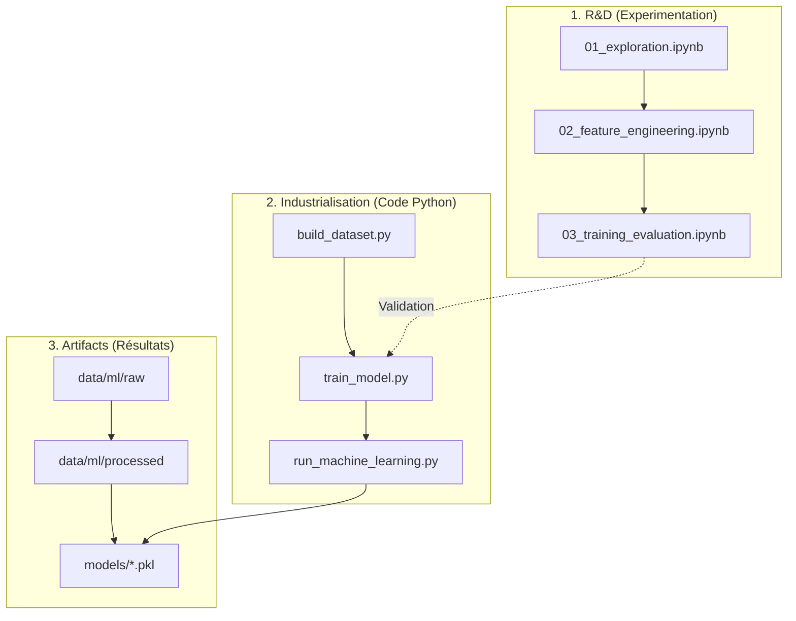

# Comprendre le Pipeline Machine Learning

Ce document explique comment est structuré le projet Machine Learning de PredictionDex, de l'expérimentation (Notebooks) à la production (Scripts Python).

## 🗺️ Vue d'Ensemble

Le projet suit une structure standard en Data Science : **R&D** → **Industrialisation** → **Production**.



---

## 📂 1. Recherche & Développement (`notebooks/`)

C'est votre **laboratoire**. Ici, le code peut être "sale", on teste des idées, on visualise des graphiques. Le but est de comprendre les données.

| Notebook | But | Description |
|----------|-----|-------------|
| **01_exploration.ipynb** | **Comprendre** | On charge les données brutes. On regarde s'il y a des valeurs manquantes, on trace des histogrammes pour voir la distribution des stats (HP, Attaque...). |
| **02_feature_engineering.ipynb** | **Transformer** | On teste des transformations mathématiques. *Exemple : Transformer le type "Feu" en colonnes numériques (One-Hot Encoding).* |
| **03_training_evaluation.ipynb** | **Comparer** | On entraîne plusieurs modèles (Random Forest, XGBoost, Regression Logistique) et on compare leurs scores pour choisir le meilleur. |

**👉 Comment jouer avec ?**
Lancez Jupyter (`jupyter notebook`) et modifiez les cellules. Si vous trouvez une nouvelle feature géniale, notez-la !

---

## 🏭 2. Pipeline de Production (`machine_learning/`)

C'est votre **usine**. Une fois qu'une idée est validée dans les notebooks, on la copie ici dans des scripts Python propres et robustes.

### `build_battle_winner_dataset.py` (Le Générateur)
Ce script crée les données d'entraînement.
1. Il se connecte à la base de données.
2. Il simule 34 000+ combats (tous les Pokémon contre tous les Pokémon).
3. Pour chaque combat, il détermine qui gagne mathématiquement.
4. Il sauvegarde le tout dans `data/ml/raw/matchups.parquet`.

### `train_model.py` (L'Entraîneur)
Ce script entraîne le modèle officiel.
1. Il charge les données générées.
2. Il applique les transformations validées (Feature Engineering).
3. Il entraîne le modèle (XGBoost).
4. Il sauvegarde le cerveau du modèle dans un fichier `.pkl` (Pickle).

### `run_machine_learning.py` (Le Chef d'Orchestre)
C'est le script "bouton magique". Il lance le Générateur puis l'Entraîneur à la suite.
```bash
python machine_learning/run_machine_learning.py --mode=all
```

---

## 📦 3. Les Données (`data/`)

C'est votre **entrepôt**.

- **`data/ml/raw/`** : Les données brutes sorties du simulateur.
- **`data/ml/processed/`** : Les données nettoyées et séparées en deux :
  - **Train (80%)** : Pour que le modèle apprenne.
  - **Test (20%)** : Pour vérifier si le modèle a bien appris (examen final).

---

## 🚀 Workflow Typique (Cycle de Vie)

Voici comment travailler efficacement :

1.  **Hypothèse** : "Je pense que si j'ajoute la différence de Vitesse entre les deux Pokémon, le modèle sera meilleur."
2.  **Test (Notebook)** : 
    - Ouvrir `02_feature_engineering.ipynb`.
    - Créer la variable `speed_diff = speed_A - speed_B`.
    - Relancer l'entraînement dans le notebook.
    - Résultat : L'accuracy passe de 92% à 94% ! 🎉
3.  **Migration (Script)** : 
    - Copier la logique de `speed_diff` dans le script `machine_learning/train_model.py`.
4.  **Production (Docker)** :
    - Lancer `docker compose up --build`.
    - Le conteneur va ré-entraîner le modèle avec votre nouvelle feature.
    - Le nouveau modèle est maintenant actif dans l'API !

---

## 🛠️ Commandes Utiles

**Lancer tout le pipeline (Génération + Entraînement) :**
```bash
python machine_learning/run_machine_learning.py --mode=all
```

**Juste ré-entraîner le modèle (si on a changé les hyperparamètres) :**
```bash
python machine_learning/run_machine_learning.py --mode=train
```

**Voir la performance du modèle actuel :**
```bash
python machine_learning/run_machine_learning.py --mode=evaluate
```
