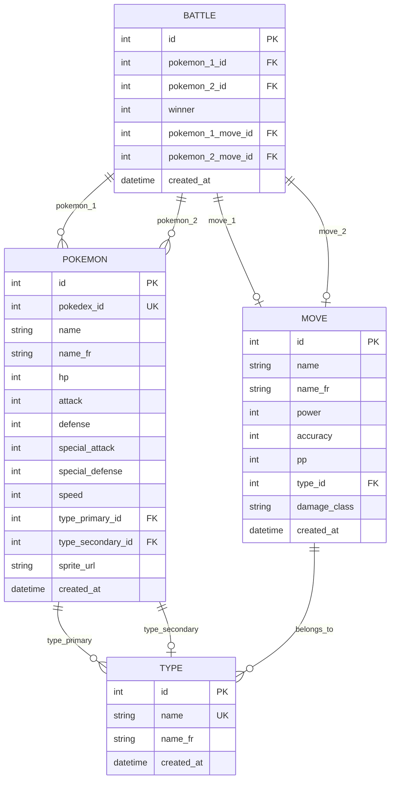

# Modèle Conceptuel de Données (MCD)

```mermaid
erDiagram
    POKEMON {
        int id PK
        int pokedex_id UK
        string name
        string name_fr
        int hp
        int attack
        int defense
        int special_attack
        int special_defense
        int speed
        int type_primary_id FK
        int type_secondary_id FK
        string sprite_url
        datetime created_at
    }
    
    TYPE {
        int id PK
        string name UK
        string name_fr
        datetime created_at
    }
    
    MOVE {
        int id PK
        string name
        string name_fr
        int power
        int accuracy
        int pp
        int type_id FK
        string damage_class
        datetime created_at
    }
    
    BATTLE {
        int id PK
        int pokemon_1_id FK
        int pokemon_2_id FK
        int winner
        int pokemon_1_move_id FK
        int pokemon_2_move_id FK
        datetime created_at
    }
    
    POKEMON ||--o{ TYPE : "type_primary"
    POKEMON ||--o| TYPE : "type_secondary"
    MOVE ||--o{ TYPE : "belongs_to"
    BATTLE ||--o{ POKEMON : "pokemon_1"
    BATTLE ||--o{ POKEMON : "pokemon_2"
    BATTLE ||--o| MOVE : "move_1"
    BATTLE ||--o| MOVE : "move_2"

```
